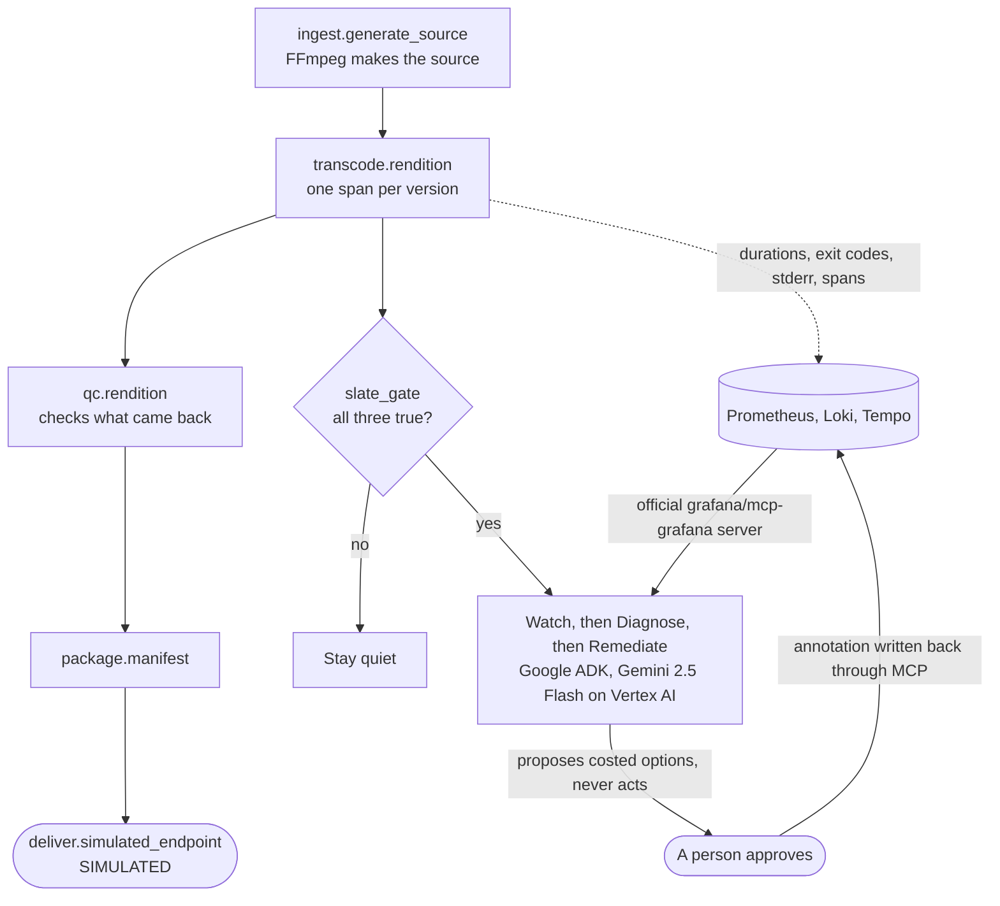

# SLATE

**A delivery date you cannot move, watched like an SLO.**

A film or episode is finished as a set of encoded versions, and a distributor sets a date in a
contract for when they have to arrive. SLATE runs that work for real, measures it, and says
**before the date** whether the remaining work still fits.

| | |
|---|---|
| Live app | <https://slate-delivery-slo-109051079423.us-central1.run.app> |
| Grafana control tower | <https://35-255-68-247.sslip.io/d/slate-delivery-slo/slate-c2b7-contractual-delivery-slo?kiosk> |
| Shortest path for a judge | [`JUDGING.md`](JUDGING.md) |
| What we have not shown | [`docs/LIMITATIONS.md`](docs/LIMITATIONS.md) |
| Prior art, named | [`docs/PRIOR-ART.md`](docs/PRIOR-ART.md) |

Track: **Grafana**. Licence: Apache-2.0.

---

## The problem, in three lines

Everything upstream of a delivery date watches for things **breaking**. So a facility finds out it
is going to miss the date at the moment it misses it.

But a delivery can be lost with nothing broken at all. Every version encodes cleanly, every check
passes, and there is simply more work left than there is time.

No alarm goes off, because nothing is wrong. It is just too late.

```
delivery_window = contractual_date - now
work_remaining  = pending versions x measured p95 per version
schedule_budget = delivery_window - work_remaining      # below zero: projected to miss
```

## See it for yourself in thirty seconds

Open the app and press **Prove it: a miss with zero failures**.

It creates a delivery of **sixteen** heavy versions against a **sixty second** window with **no
fault injected**, then encodes three of them, one per wave, with real FFmpeg. Every one passes.
The other thirteen are outstanding work the gate has to project, and by the third wave there is
more work left than there is window.

Three detectors are then run over that same measured data:

| Detector | Result |
|---|---|
| `any_failure` | **Silent.** Nothing failed, and it stays silent until the date goes by |
| `deadline_passed` | **Silent.** Correct, and useless |
| `slate_gate` | **Fires**, while there is still enough window left to act on it |

Underneath, *what the warning buys you*: doing nothing misses the date, and approving a couple
more encoding workers lands it before the date. That is arithmetic over the p95 those encodes just
measured, not a rate card.

**What this does not show**, and the page says so: SLATE does not beat a failure alert to a hard
failure. A failure is instant and nothing beats it. It shows the failure alert is answering a
different question.

## How it fits together



Everything in that diagram is real execution except the node marked SIMULATED. The span names are
the ones you will find in Tempo.

## Two decisions the model cannot make

**Is this delivery in jeopardy?** A pure function in [`slate_app/gate.py`](slate_app/gate.py)
decides. An incident opens only when all three are true:

1. `projected_completion_after_contract`
2. `positive_burn_sustained_two_windows`, each window at least five seconds
3. `work_remaining_positive`

The second is why one bad moment cannot raise an alarm, and it is why the proof above takes three
runs rather than one.

**Why did this version fail?** A deterministic classifier decides, from FFmpeg's own stderr, exit
status, output size and QC result, in [`slate_app/classify.py`](slate_app/classify.py).

That second one used to be false, and it is the most important thing in this repository. An
earlier build labelled each failure with the fault that had been *injected*, wrote that label onto
the trace and the metric, then asked the agent to "diagnose" it. The agent read the answer key
back and the benchmark scored that round trip at 100%. A scenario now only arranges reality, and
the class has to be recovered from what FFmpeg actually printed. Guards enforce it: the
classifier's source may not contain `fault_mode`, and neither may the measurement path.

Gemini corroborates both decisions and proposes bounded options. Remediate has a typed schema
limited to four actions the API can really perform, and the approval endpoint returns **409** for
anything the agent did not propose.

## What runs through the official Grafana MCP server

| Operation | Tool | Where |
|---|---|---|
| Metrics | `query_prometheus` | Agent evidence, health probe, AI-observability read-back |
| Logs | `query_loki_logs` | Agent evidence, the real FFmpeg stderr |
| Traces | `tempo_get-trace` | Per-delivery span tree, ingest through simulated delivery |
| Dashboard search | `search_dashboards` | Returns a link back to Grafana for a human, rather than paraphrasing the view |
| Alert rule write | `alerting_manage_rules` | A Grafana-managed rule provisioned per delivery at creation |
| Annotation write | `create_annotation` | After, and only after, a human approves a remediation |
| Panel render | `get_panel_image` | Grafana draws the panel, MCP carries the PNG, Gemini reads the chart |

### Three of those seven are not the obvious use

The first four are what anyone would do with observability MCP. These three are the reason this
integration is worth a look:

- **`alerting_manage_rules`.** Alert rules are normally authored once by a person and left alone.
  SLATE writes one **per delivery** at creation, because the thing being watched is a contract and
  every contract has a different date. The rule is deleted with the delivery.
- **`create_annotation`.** The write is not the agent acting. It fires only after a human approves,
  so the Grafana timeline becomes the audit record of who decided what, and when.
- **`get_panel_image`.** MCP is treated as a text API almost everywhere. Here Grafana renders the
  same panel the supervisor is looking at, MCP carries the PNG back, and Gemini reads the *chart*.
  The image it was given is shown beside the reading so you can check one against the other.

### Coverage against what the track requirement names

The server advertises **72 tools**; SLATE calls seven, each with a stated reason.
`/v1/integrations/grafana/inventory` returns the requirement's capability list in the
requirement's own wording, mapped to the tool that answers it, and the product page renders it.
**Seven of the eight are covered.**

The eighth, investigating incidents through Grafana IRM, is a Grafana Cloud plugin. The rules
direct unattended deployments to the self-hosted OSS server, and that choice is what removes it.
`update_dashboard` is advertised and refused **on purpose**, so the operator's view is not
something the model can rewrite. Both declines are listed on the page with why, rather than being
quietly absent.

The agents' own OpenTelemetry `gen_ai.*` token, latency and tool series are read back through that
same MCP server at `/v1/integrations/grafana/ai-observability`.

## Not a fixed demo path

Three things a judge can drive that are not our fixtures:

- **Named presets** at `/v1/presets`. Each loads in a click, downloads as JSON, and is *exactly*
  the body `POST /v1/deliveries` accepts. A test asserts the downloaded file posted back unchanged
  creates the same record, so a preset is not a privileged path.
- **Your own encode ladder.** The rows on the page are the FFmpeg arguments. Ask for `libx265` at
  3840x2160 and that is what encodes; ask for something out of range and you get a 422 rather than
  a silent clamp.
- **Your own PromQL** at `/v1/analyze/promql`, through the same MCP server the agents use,
  returning the server's raw response including its own error text. The agents run three fixed
  queries on purpose, because an agent free to compose any query can compose a misleading one.
  That is a limit on the agent, not on the integration.

The three contracted titles on the board are fixtures whose dates roll forward as they approach,
so the board is never found expired. Only the date moves; the measurements stay as the real runs
left them, and anything you create is never rewritten. See `/v1/board/fixtures`.

Nothing is rate limited except the two endpoints that spend Gemini tokens, and their allowance is
set above what anyone can reach by clicking. No key is needed for anything on the page.

## Run it locally

FFmpeg is required. FFprobe is preferred; without it SLATE decodes the actual output with FFmpeg
rather than trusting what was requested. It never substitutes simulated timings.

```powershell
python -m venv .venv
.\.venv\Scripts\python.exe -m pip install -r requirements.txt pytest httpx
.\.venv\Scripts\python.exe -m uvicorn slate_app.main:app --reload
```

Grafana integration is optional locally. Without credentials every integration route returns 503
rather than a local guess. To point it at your own stack, see
[`docs/GRAFANA-SETUP.md`](docs/GRAFANA-SETUP.md).

## Testing

```powershell
.\.venv\Scripts\python.exe -m pytest -q                  # 108 passed, 11 skipped without FFmpeg
.\.venv\Scripts\python.exe scripts\check_page.py         # loads the page in a real browser
.\.venv\Scripts\python.exe scripts\mutation_check.py     # breaks the classifier on purpose
.\.venv\Scripts\python.exe scripts\e2e_check.py          # 68 scenarios against a live deployment
```

Three of those exist because each one caught a real defect the others could not see:

- **The 11 skips are the FFmpeg-dependent proofs.** CI installs FFmpeg and sets
  `SLATE_REQUIRE_FULL_SUITE=1`, which turns a skip into a failure, so a broken FFmpeg install
  cannot leave the badge green over proofs that never ran.
- **`scripts/mutation_check.py`** breaks the classifier six ways and fails if a guard does not
  notice. It found one of our own guards reporting success while the answer-key leak was still
  present.
- **`scripts/check_page.py`** loads the page in a headless browser and asserts the DOM only
  JavaScript can build. It has caught the page rendering nothing at all, three times, while every
  unit test stayed green.
- **`scripts/e2e_check.py`** drives 68 scenarios over real HTTP against a deployment, including
  both slow proofs, and exits non-zero on failure. It found that the blind-spot proof was firing
  one second before the contractual date, which is correct and useless.

CI additionally enforces the contest's Google-only AI policy by failing the build if `openai`,
`anthropic`, `mistral`, `cohere` or `bedrock` appears in dependencies.

`scripts/seed_board.py` resets a board and leaves the three contracted titles with fresh dates.

## Research this is built on

The mechanic is not ours. We took it from the source and inverted one thing.

| Source | What we took |
|---|---|
| Google, *Site Reliability Engineering*, ch. 4, ["Service Level Objectives"](https://sre.google/sre-book/service-level-objectives/) | The error budget: an allowance you spend, not a line you must never cross |
| Google, *The Site Reliability Workbook*, ch. 5, ["Alerting on SLOs"](https://sre.google/workbook/alerting-on-slos/) | Burn rate, and why alerting on the rate beats alerting on the breach |

**The inversion:** in SRE the deadline is soft and reliability is the budget. Here the contractual
date is hard and **schedule** is the resource being burned.

## Prior art, and what we do not claim

We went looking before claiming anything. Full table with sources in
[`docs/PRIOR-ART.md`](docs/PRIOR-ART.md).

| What already exists | Named | How SLATE differs |
|---|---|---|
| Pipeline observability | Prometheus and Grafana, the standard media-infrastructure stack | Commodity. We are not claiming it, we use exactly it |
| Automated QC and conformance | Telestream Vidchecker, Interra BATON, Shade, EditShare | They answer "is this file correct", file by file. Neither answers "does the remaining work still fit before the date" |
| Predictive pre-miss alerting | Logistics and supply-chain platforms | The same mechanic in another industry. We name it rather than presenting it as new |
| Error budgets applied to delivery | SRE practice and the writing cited above | The reframe has prior art. Our inversion, keeping the deadline hard and burning schedule, is a move, not an invention |
| Media supply-chain orchestration | SDVI Rally, Dalet Flex, Vidispine, Ateme | **Unconfirmed in both directions.** We did not establish whether they predict contractual deadline risk, and we do not claim they cannot |

**What we do claim** is narrow: this pattern applied to a media deliverable pipeline where the
failure unit is one encoded version, with the telemetry generated by really doing the work, every
consequential decision owned by deterministic code or a person, and the partner's MCP server as
the only path the agents have to observe or act.

**What we have not shown:** the delivery receiver is simulated, the benchmark is engineering
evidence at engineering scale rather than a production accuracy study, and no streaming or
broadcast operations professional has reviewed this. All of it is in
[`docs/LIMITATIONS.md`](docs/LIMITATIONS.md).
